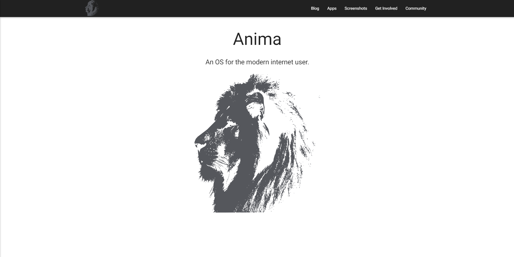

Anima's official project website. The design helped me embrace fluid, responsive web design.
The vast majority of the website is implented using [Jekyll](https://jekyllrb.com/), a microsite alternative to a full fledged CMS.

The [Team Section](https://www.anima-os.com/team/) utilizes [Angular](https://angular.io/) for the general data binding, [JSON](https://github.com/Anima-OS/Anima-OS.com/blob/master/_data/authors.yml) as a datasource, and [Moment](https://momentjs.com/) for the ``local member time`` display.

[MaterializeCSS](https://materializecss.com) is used extensively for all styling, the screenshot gallery and tooltips.

<a href="https://github.com/Anima-OS/Anima-OS.com"><i class="large github icon"></i>Source</a>
